# Benchmarks

Performance comparison of **MariaDB Connector/Python**, both the `mariadb` C
extension and the pure-Python implementation, against the other Python
drivers:

- **Synchronous**: [PyMySQL](https://pypi.org/project/PyMySQL/) (pure Python) and
  [MySQL Connector/Python](https://pypi.org/project/mysql-connector-python/)
  (its C and pure-Python variants).
- **Asynchronous** (`asyncio`): [asyncmy](https://pypi.org/project/asyncmy/)
  (C, Cython) and [aiomysql](https://pypi.org/project/aiomysql/) (pure Python).

Every number on this page is produced by the benchmark suite in the
[`benchmarks/`](../benchmarks) folder of this repository and can be reproduced
with the commands under [Reproducing](#reproducing).

## TL;DR

### Synchronous drivers

The `mariadb` **C extension is the fastest driver in almost every benchmark**;
the pure-Python `mariadb` implementation edges it only where there is nothing to
parse (`DO 1`, `DO 1000 params` in text mode) or where the work is building the
packet (the 10,000-row batch insert). The pure-Python `mariadb` implementation
is the **fastest pure-Python driver in every benchmark** and on result-set
parsing it is **on par with MySQL Connector/Python's C extension** (e.g.
`SELECT 100 columns`, text: 6,929 vs 7,126 ops/s; binary: 6,053 vs 5,501 ops/s).
Selected results (operations per second, higher is better):

| Workload | mariadb (C) | vs pure-Python `mariadb` | vs MySQL Connector/C |
|---|---|---|---|
| `SELECT 1` (simple query) | **84,663 ops/s** | 1.7× faster | 2.5× faster |
| `SELECT 1000 rows` (binary) | **5,670 ops/s** | 4.6× faster | 3.8× faster |
| `SELECT 100 columns` (binary) | **13,065 ops/s** | 2.2× faster | 2.4× faster |
| `DO 1000 params` (binary) | **2,747 ops/s** | 2.0× faster | 35× faster |
| Batch `INSERT` (100 rows) | **8,023 ops/s** | 1.2× faster | 3.4× faster |
| 500 pooled queries from 20 threads | **54 ops/s** | 1.8× faster | 2.6× faster |

### Asynchronous drivers

No single async driver wins everywhere. The `mariadb` C extension leads on
round-trips with a result set, wide rows, small batches, **opening many
connections at once** (1.5× asyncmy, 1.9× the pure-Python driver) and above
all the **connection pool** (3.9× asyncmy, 2.2× aiomysql). The pure-Python
`mariadb` driver leads on **bulk inserts** (10,000 rows: 2.7× asyncmy) and
ties the C extension on parameter binding. **asyncmy's Cython row parser
leads on bulk reads** (1000 plain rows: 2.0× the C extension) and, by a hair,
on the bare `DO 1` round-trip. aiomysql is last everywhere except on
connection setup, where it edges the pure-Python `mariadb` driver.

This split is a deliberate trade-off: the `mariadb` async implementation is
tuned for **small result sets**, which are by far the most common case in
real applications (point queries, single-row lookups, short lists), rather
than for streaming thousands of rows per query. asyncmy's row parser builds
a tuple of per-column converter functions once per result set and calls one
per field; that setup pays off over thousands of rows but is pure overhead on
a one-row result. Measured on the pure-Python row decoder with identical
buffers (see the note under the async table below), the per-column-function
design decodes a one-row `SELECT 1` 20% slower and a one-row, 10-column
mixed result 8 to 11% slower, for a 6 to 7% gain on 1000-row results. We
keep the design that wins on the small result set. That is why the driver
leads on `SELECT 1`, wide single rows, connection setup and the pool, and
trails only on the bulk-read benchmark.

| Workload | fastest | mariadb (C) | mariadb (pure Python) | asyncmy (C) |
|---|---|---|---|---|
| `SELECT 1` | mariadb (C) | **26,141 ops/s** | 1.2× slower | 1.2× slower |
| `SELECT 100 columns` | mariadb (C) | **11,677 ops/s** | 2.1× slower | 2.4× slower |
| Batch `INSERT` (10,000 rows) | mariadb (pure Python) | 1.1× slower | **50 ops/s** | 2.7× slower |
| `SELECT 1000 rows` | asyncmy | 2.0× slower | 4.3× slower | **5,446 ops/s** |
| 50 concurrent connect + query + close | mariadb (C) | **224 ops/s** | 1.9× slower | 1.5× slower |
| 500 pooled queries, 5–20 pool | mariadb (C) | **35 ops/s** | 1.5× slower | 3.9× slower |

## Environment

|  |  |
|---|---|
| CPU | Intel Core i9-11900K, governor `performance`, client pinned to one core (`taskset -c 4`) |
| OS / Python | Linux · CPython 3.14.4 |
| Server | MariaDB 12.3.2 · Unix socket · TLS off |
| Drivers | mariadb 2.0 (C extension and pure Python) · PyMySQL 1.2.0 · mysql-connector-python 9.7.0 · asyncmy 0.2.14 · aiomysql 0.3.2 |
| Tooling | [pytest-benchmark](https://pypi.org/project/pytest-benchmark/) 5.2.3 · ≥ 1000 rounds per micro-benchmark, fewer for the heavy scenarios (10k-row batches, pools, connection storms) · GC disabled during timing |
| Method | 1 warm-up pass (discarded) then 3 reported passes; the **median** per-call time across the 3 is reported (→ ops/s) |
| Date | 2026-09-12 (sync), 2026-09-13 (async) |

> ⚠️ Sub-millisecond micro-benchmarks are sensitive to machine state (CPU
> frequency scaling, background load, caches). These figures are meant for
> *relative* comparison between drivers on identical hardware, not as absolute
> throughput guarantees. A column is shown as `–` when a driver does not
> implement that variant (e.g. PyMySQL has no binary/prepared protocol path and
> no connection pool; aiomysql has no binary protocol).

## Synchronous drivers

All drivers use the blocking API from a single thread, except for the last two
rows where 50 or 20 threads share the one pinned core (so these measure how a
driver behaves under the GIL as much as its wire efficiency).

| Benchmark | mariadb – C extension | mariadb – pure Python | PyMySQL – pure Python | mysql-connector – C | mysql-connector – pure Python |
|---|---|---|---|---|---|
| DO 1 — command round-trip | 101,379 ops/s (1.0x) | 105,469 ops/s **(fastest)** | 92,207 ops/s (1.1x) | 54,052 ops/s (2.0x) | 31,207 ops/s (3.4x) |
| SELECT 1 — simple query | 84,663 ops/s **(fastest)** | 49,212 ops/s (1.7x) | 43,138 ops/s (2.0x) | 34,163 ops/s (2.5x) | 18,215 ops/s (4.6x) |
| INSERT — mixed types (single row) | 33,404 ops/s **(fastest)** | 27,108 ops/s (1.2x) | 27,623 ops/s (1.2x) | 29,880 ops/s (1.1x) | 17,617 ops/s (1.9x) |
| Batch INSERT — 100 rows (executemany) | 8,023 ops/s **(fastest)** | 6,529 ops/s (1.2x) | 2,157 ops/s (3.7x) | 2,355 ops/s (3.4x) | 1,787 ops/s (4.5x) |
| SELECT 1000 rows — binary protocol | 5,670 ops/s **(fastest)** | 1,246 ops/s (4.6x) | – | 1,495 ops/s (3.8x) | 288 ops/s (19.7x) |
| SELECT 1000 rows — text protocol | 6,522 ops/s **(fastest)** | 1,464 ops/s (4.5x) | 534 ops/s (12.2x) | 1,754 ops/s (3.7x) | 354 ops/s (18.4x) |
| SELECT 100 columns — binary protocol | 13,065 ops/s **(fastest)** | 6,053 ops/s (2.2x) | – | 5,501 ops/s (2.4x) | 1,221 ops/s (10.7x) |
| SELECT 100 columns — text protocol | 17,013 ops/s **(fastest)** | 6,929 ops/s (2.5x) | 2,533 ops/s (6.7x) | 7,126 ops/s (2.4x) | 2,373 ops/s (7.2x) |
| DO 1000 params — binary protocol | 2,747 ops/s **(fastest)** | 1,365 ops/s (2.0x) | – | 79 ops/s (35.0x) | 61 ops/s (44.7x) |
| DO 1000 params — text protocol | 4,027 ops/s (1.0x) | 4,031 ops/s **(fastest)** | 2,208 ops/s (1.8x) | 2,850 ops/s (1.4x) | 1,075 ops/s (3.7x) |
| Batch INSERT — 10,000 rows (executemany) | 47 ops/s (1.1x) | 52 ops/s **(fastest)** | 15 ops/s (3.5x) | 15 ops/s (3.5x) | 8 ops/s (6.9x) |
| 50 threads: connect + query + close | 273 ops/s **(fastest)** | 160 ops/s (1.7x) | 141 ops/s (1.9x) | 153 ops/s (1.8x) | 72 ops/s (3.8x) |
| 500 queries from 20 threads through a 5–20 pool | 54 ops/s **(fastest)** | 30 ops/s (1.8x) | – | 21 ops/s (2.6x) | 9 ops/s (6.4x) |

*(Multiplier in parentheses is how much slower than the fastest driver for that row.)*

### Simple operations


### Insert


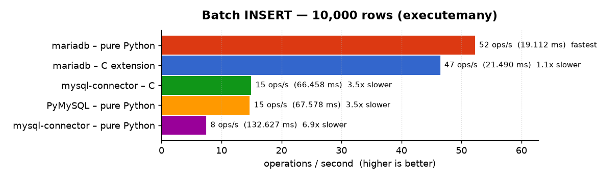

### Bulk reads


### Wide rows


### Many parameters


### Threads and pools

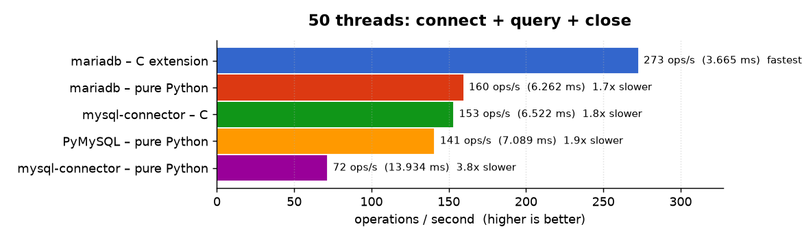
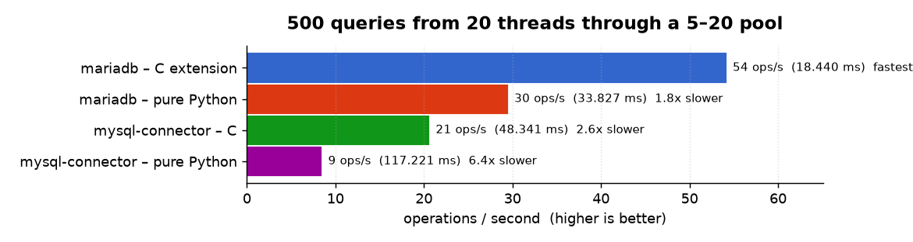

## Asynchronous drivers

The `asyncio` suite compares `mariadb.AsyncConnection` (C extension and pure
Python) with asyncmy and aiomysql on one event loop, over the same Unix socket
with TLS off. The first six benchmarks mirror the synchronous ones; the three
scenarios that follow are modelled on
[asyncmy's own benchmark suite](https://github.com/long2ice/asyncmy/tree/dev/benchmark):
a 10,000-row batch insert, 50 concurrent connections (each doing connect,
a single-row point query and close), and 500 concurrent queries through a
5–20 connection pool
(`mariadb.create_async_pool`, `asyncmy.pool.create_pool`, `aiomysql.create_pool`).

When reading the `SELECT 1000 rows` row below, keep in mind that the
`mariadb` async drivers deliberately favour small result sets over large
ones: per-query overhead (round-trip, connection setup, pool hand-off) is
minimised first, because the vast majority of application queries return a
handful of rows. Bulk reads are a secondary target.

The row decoder illustrates the choice. asyncmy resolves a converter
function per column once per result set and then calls `converter(value)`
for every field; the `mariadb` decoder does no per-result-set setup and
dispatches on the column type inline, with the most common types tested
first. Replaying the same text-protocol buffers through the pure-Python
decoder written both ways (median of 3 runs, one core, CPython 3.14) gives:

| Result set | inline dispatch (ours) | per-column functions | change |
|---|---|---|---|
| 1 row × 1 int (`SELECT 1`) | 534 ns | 641 ns | +20% |
| 1 row × 10 mixed columns | 3.15 µs | 3.45 µs | +8 to +11% |
| 1000 rows × 1 int | 371 µs | 345 µs | −6% |
| 1000 rows × 10 mixed columns | 3.10 ms | 2.90 ms | −7% |

The per-column-function layout only starts paying back after a few dozen
rows, and asyncmy's remaining lead on 1000 rows comes from its Cython
implementation rather than from that layout. An earlier variant that
precomputed per-column "kind" codes once per result set showed the same
pattern end to end (+1 to 2% on single-row queries for −12% on a 10,000-row
scan) and was rejected for the same reason.

| Benchmark | mariadb – C extension (async) | mariadb – pure Python (async) | asyncmy – C (Cython) | aiomysql – pure Python |
|---|---|---|---|---|
| DO 1 — command round-trip | 29,774 ops/s (1.1x) | 30,666 ops/s (1.0x) | 32,040 ops/s **(fastest)** | 29,820 ops/s (1.1x) |
| SELECT 1 — simple query | 26,141 ops/s **(fastest)** | 21,739 ops/s (1.2x) | 22,231 ops/s (1.2x) | 18,968 ops/s (1.4x) |
| Batch INSERT — 100 rows (executemany) | 5,502 ops/s **(fastest)** | 4,784 ops/s (1.2x) | 2,144 ops/s (2.6x) | 1,945 ops/s (2.8x) |
| Batch INSERT — 10,000 rows (executemany) | 44 ops/s (1.1x) | 50 ops/s **(fastest)** | 18 ops/s (2.7x) | 15 ops/s (3.4x) |
| SELECT 1000 rows | 2,783 ops/s (2.0x) | 1,256 ops/s (4.3x) | 5,446 ops/s **(fastest)** | 420 ops/s (13.0x) |
| SELECT 100 columns | 11,677 ops/s **(fastest)** | 5,588 ops/s (2.1x) | 4,894 ops/s (2.4x) | 2,072 ops/s (5.6x) |
| DO 1000 params | 3,471 ops/s **(fastest)** | 3,446 ops/s (1.0x) | 2,895 ops/s (1.2x) | 2,389 ops/s (1.5x) |
| 50 concurrent connect + query + close | 224 ops/s **(fastest)** | 121 ops/s (1.9x) | 152 ops/s (1.5x) | 130 ops/s (1.7x) |
| 500 concurrent queries through a 5–20 pool | 35 ops/s **(fastest)** | 24 ops/s (1.5x) | 9 ops/s (3.9x) | 16 ops/s (2.2x) |

*(Multiplier in parentheses is how much slower than the fastest driver for that row.)*

### Simple operations

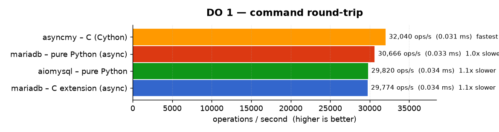
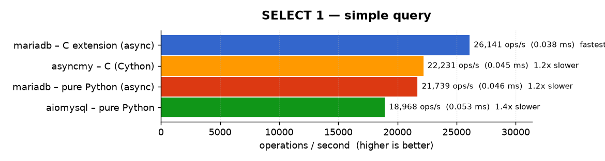

### Insert

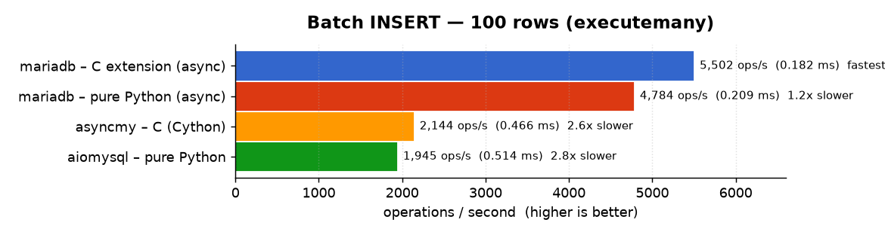
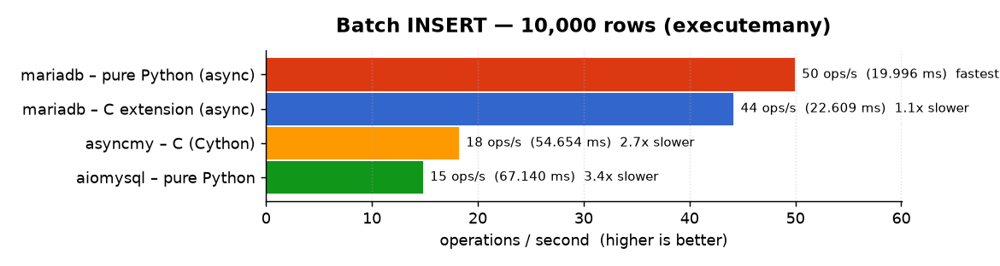

### Bulk reads and wide rows

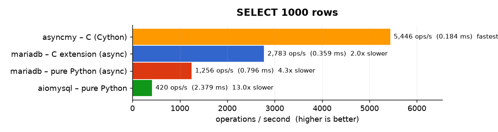
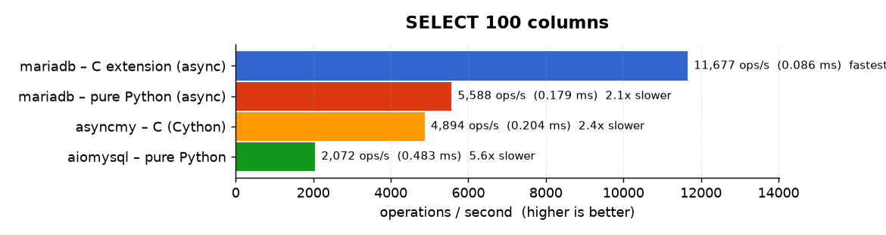

### Many parameters

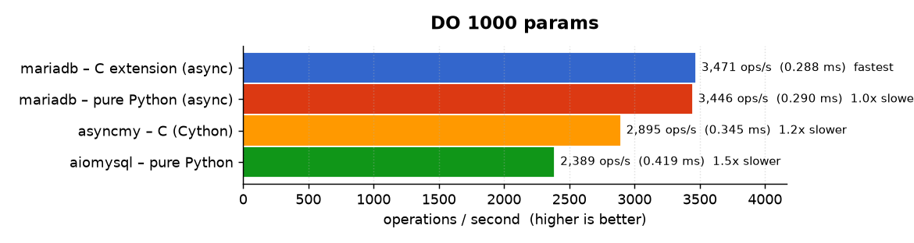

### Concurrency and pools

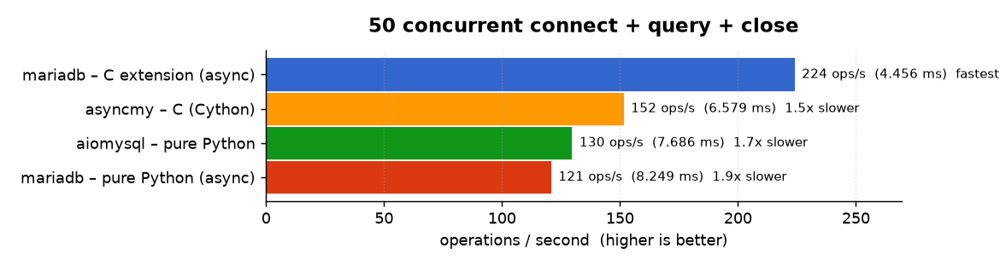
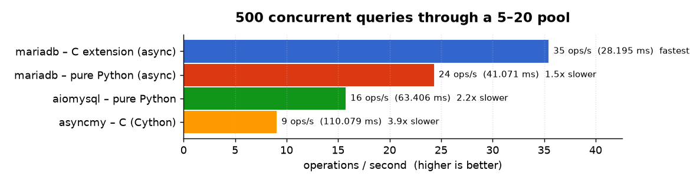

## Reproducing

From a checkout, with a MariaDB/MySQL server running:

```bash
cd benchmarks
pip install -r requirements-bench.txt          # pytest-benchmark, pymysql, mysql-connector-python, asyncmy, aiomysql
export TEST_DB_HOST=127.0.0.1 TEST_DB_PORT=3306 TEST_DB_USER=root TEST_DB_DATABASE=testp
export TEST_DB_UNIX_SOCKET=/run/mysqld/mysqld.sock   # all drivers over this socket; unset for TCP/IP
python run_all_benchmarks.py                    # sync drivers  -> results_<timestamp>/benchmark_<driver>.json
python run_async_benchmarks.py --all            # async drivers -> benchmark_async_<driver>.json (+ comparison table)
```

For the stable numbers shown above, pin the CPU to maximum frequency, pin the
client to one core, warm the machine with a discarded pass, then report the
**median** of several passes (which filters out any unlucky pass):

```bash
sudo cpupower frequency-set -g performance      # restore later: -g powersave
taskset -c 4 python run_all_benchmarks.py        # warm-up (discarded)
for i in 1 2 3; do                               # reported passes -> three results_* dirs
  taskset -c 4 python run_all_benchmarks.py
done
taskset -c 4 python run_async_benchmarks.py --all   # warm-up (discarded)
for i in 1 2 3; do                               # reported passes
  taskset -c 4 python run_async_benchmarks.py --all
  mkdir -p results_async_$i && mv benchmark_async_*.json results_async_$i/
done
```

Regenerate the charts and both tables on this page from the results
directories (charts are rendered with [matplotlib](https://matplotlib.org/)
using the Google Charts colour palette; with several directories the
per-benchmark median across them is used):

```bash
pip install matplotlib
python make_charts.py results_* results_async_*   # writes ../docs/benchmarks/*.png,
                                                  # comparison_table.md and comparison_table_async.md
taskset -c 4 python colfunc_bench.py              # row-decoder layout comparison (async section)
```

Individual drivers and benchmarks can also be run directly — see
[`benchmarks/README.md`](../benchmarks/README.md) and
[`benchmarks/BENCHMARKS.md`](../benchmarks/BENCHMARKS.md).
