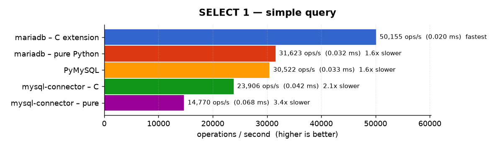
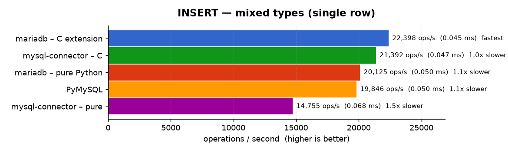
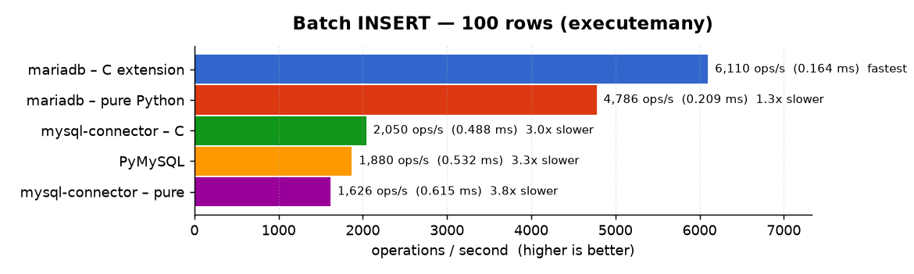
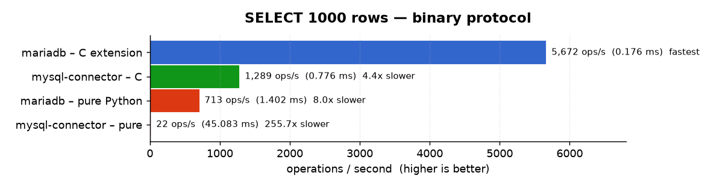
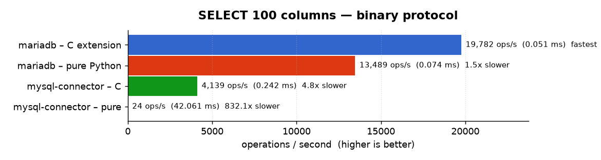
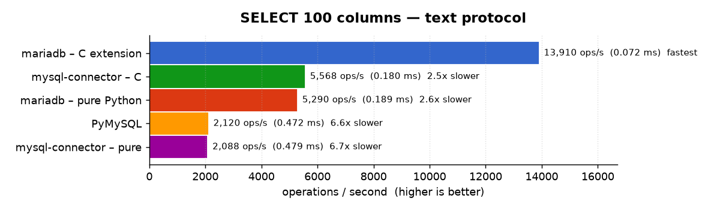
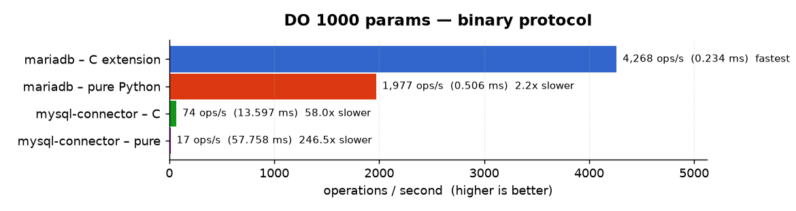
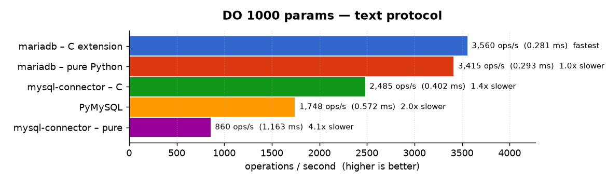

# Benchmarks

Performance comparison of **MariaDB Connector/Python**. Both the `mariadb` C
extension and the pure-Python implementation against
[PyMySQL](https://pypi.org/project/PyMySQL/) and
[MySQL Connector/Python](https://pypi.org/project/mysql-connector-python/)
(its C and pure-Python variants).

Every number on this page is produced by the benchmark suite in the
[`benchmarks/`](../benchmarks) folder of this repository and can be reproduced
with the commands under [Reproducing](#reproducing).

## TL;DR

The `mariadb` **C extension is the fastest driver in every benchmark**, and the
pure-Python `mariadb` implementation comes second in most of them. Selected
results (operations per second, higher is better):

| Workload | mariadb (C) | vs pure-Python `mariadb` | vs MySQL Connector/C |
|---|---|---|---|
| `SELECT 1` (simple query) | **50,155 ops/s** | 1.6× faster | 2.1× faster |
| `SELECT 1000 rows` (binary) | **5,672 ops/s** | 8.0× faster | 4.4× faster |
| `SELECT 100 columns` (binary) | **19,782 ops/s** | 1.5× faster | 4.8× faster |
| `DO 1000 params` (binary) | **4,268 ops/s** | 2.2× faster | 58× faster |
| Batch `INSERT` (100 rows) | **6,110 ops/s** | 1.3× faster | 3.0× faster |

## Environment

|  |  |
|---|---|
| CPU | Intel Core i9-11900K, governor `performance` (~4.8 GHz), client pinned to one core (`taskset -c 4`) |
| OS / Python | Linux · CPython 3.12.3 |
| Server | MariaDB 12.3.2 · TCP · TLS off |
| Tooling | [pytest-benchmark](https://pypi.org/project/pytest-benchmark/) · ≥ 1000 rounds per benchmark · GC disabled |
| Method | two full passes; the **second** (warmed-up) pass is reported (mean per-call time → ops/s) |
| Date | 2026-06-18 |

> ⚠️ Sub-millisecond micro-benchmarks are sensitive to machine state (CPU
> frequency scaling, background load, caches). These figures are meant for
> *relative* comparison between drivers on identical hardware, not as absolute
> throughput guarantees. A column is shown as `–` when a driver does not
> implement that variant (e.g. PyMySQL has no binary/prepared protocol path).

## Full results

| Benchmark | mariadb – C extension | mariadb – pure Python | PyMySQL | mysql-connector – C | mysql-connector – pure |
|---|---|---|---|---|---|
| DO 1 — command round-trip | 65,828 ops/s **(fastest)** | 60,869 ops/s (1.1x) | 59,863 ops/s (1.1x) | 33,994 ops/s (1.9x) | 23,257 ops/s (2.8x) |
| SELECT 1 — simple query | 50,155 ops/s **(fastest)** | 31,623 ops/s (1.6x) | 30,522 ops/s (1.6x) | 23,906 ops/s (2.1x) | 14,770 ops/s (3.4x) |
| INSERT — mixed types (single row) | 22,398 ops/s **(fastest)** | 20,125 ops/s (1.1x) | 19,846 ops/s (1.1x) | 21,392 ops/s (1.0x) | 14,755 ops/s (1.5x) |
| Batch INSERT — 100 rows (executemany) | 6,110 ops/s **(fastest)** | 4,786 ops/s (1.3x) | 1,880 ops/s (3.3x) | 2,050 ops/s (3.0x) | 1,626 ops/s (3.8x) |
| SELECT 1000 rows — binary protocol | 5,672 ops/s **(fastest)** | 713 ops/s (8.0x) | – | 1,289 ops/s (4.4x) | 22 ops/s (255.7x) |
| SELECT 1000 rows — text protocol | 5,220 ops/s **(fastest)** | 854 ops/s (6.1x) | 444 ops/s (11.8x) | 1,429 ops/s (3.7x) | 298 ops/s (17.5x) |
| SELECT 100 columns — binary protocol | 19,782 ops/s **(fastest)** | 13,489 ops/s (1.5x) | – | 4,139 ops/s (4.8x) | 24 ops/s (832.1x) |
| SELECT 100 columns — text protocol | 13,910 ops/s **(fastest)** | 5,290 ops/s (2.6x) | 2,120 ops/s (6.6x) | 5,568 ops/s (2.5x) | 2,088 ops/s (6.7x) |
| DO 1000 params — binary protocol | 4,268 ops/s **(fastest)** | 1,977 ops/s (2.2x) | – | 74 ops/s (58.0x) | 17 ops/s (246.5x) |
| DO 1000 params — text protocol | 3,560 ops/s **(fastest)** | 3,415 ops/s (1.0x) | 1,748 ops/s (2.0x) | 2,485 ops/s (1.4x) | 860 ops/s (4.1x) |

*(Multiplier in parentheses is how much slower than the fastest driver for that row.)*

### Simple operations




### Insert




### Bulk reads




### Wide rows




### Many parameters




## Reproducing

From a checkout, with a MariaDB/MySQL server running:

```bash
cd benchmarks
pip install -r requirements-bench.txt          # pytest-benchmark, pymysql, mysql-connector-python
export TEST_DB_HOST=127.0.0.1 TEST_DB_PORT=3306 TEST_DB_USER=root TEST_DB_DATABASE=testp
export TEST_DB_UNIX_SOCKET=/run/mysqld/mysqld.sock   # all drivers over this socket; unset for TCP/IP
python run_all_benchmarks.py                    # all drivers -> results_<timestamp>/
```

For the stable numbers shown above, pin the CPU to maximum frequency, pin the
client to one core, and take the **second** of two runs:

```bash
sudo cpupower frequency-set -g performance      # restore later: -g powersave
taskset -c 4 python run_all_benchmarks.py        # warm-up (discarded)
taskset -c 4 python run_all_benchmarks.py        # reported run
```

Regenerate the charts and the table on this page from a results directory
(charts are rendered with [matplotlib](https://matplotlib.org/) using the
Google Charts colour palette):

```bash
pip install matplotlib
python make_charts.py results_<timestamp>        # writes ../docs/benchmarks/*.png + comparison_table.md
```

Individual drivers and benchmarks can also be run directly — see
[`benchmarks/README.md`](../benchmarks/README.md) and
[`benchmarks/BENCHMARKS.md`](../benchmarks/BENCHMARKS.md).
