# Benchmarks

Performance comparison of **MariaDB Connector/Python**, both the `mariadb` C
extension and the pure-Python implementation, against the other Python
drivers:

- **Synchronous**: [PyMySQL](https://pypi.org/project/PyMySQL/) (pure Python) and
  [MySQL Connector/Python](https://pypi.org/project/mysql-connector-python/)
  (its C and pure-Python variants).
- **Asynchronous** (`asyncio`): [asyncmy](https://pypi.org/project/asyncmy/)
  (C, Cython) and [aiomysql](https://pypi.org/project/aiomysql/) (pure Python).

Every number on this page is produced by the benchmark suite in the
[`benchmarks/`](../benchmarks) folder of this repository and can be reproduced
with the commands under [Reproducing](#reproducing).

## TL;DR

### Synchronous drivers

The `mariadb` **C extension is the fastest driver in almost every benchmark**


| Workload | mariadb (C) | vs pure-Python `mariadb` | vs MySQL Connector/C |
|---|---|---|---|
| `SELECT 1` (simple query) | **77,241 ops/s** | 1.7× faster | 2.4× faster |
| `SELECT 1000 rows` (binary) | **5,216 ops/s** | 3.8× faster | 3.8× faster |
| `SELECT 100 columns` (binary) | **11,287 ops/s** | 2.1× faster | 2.2× faster |
| `DO 1000 params` (binary) | **2,292 ops/s** | 1.7× faster | 31× faster |
| Batch `INSERT` (100 rows) | **7,511 ops/s** | 1.2× faster | 3.3× faster |
| 500 pooled queries from 20 threads | **52 ops/s** | 2.0× faster | 2.6× faster |

### Asynchronous drivers


| Workload | fastest | mariadb (C) | mariadb (pure Python) | asyncmy (C) |
|---|---|---|---|---|
| `SELECT 1` | mariadb (C) | **26,118 ops/s** | 1.3× slower | 1.1× slower |
| `SELECT 100 columns` | mariadb (C) | **11,989 ops/s** | 2.1× slower | 2.7× slower |
| Batch `INSERT` (10,000 rows) | mariadb (pure Python) | 1.2× slower | **52 ops/s** | 2.9× slower |
| `SELECT 1000 rows` | asyncmy | 2.1× slower | 3.5× slower | **5,652 ops/s** |
| 50 concurrent connect + query + close | mariadb (C) | **226 ops/s** | 1.8× slower | 1.5× slower |
| 500 pooled queries, 5–20 pool | mariadb (C) | **36 ops/s** | 1.4× slower | 4.0× slower |

## Environment

|  |  |
|---|---|
| CPU | Intel Core i9-11900K, governor `performance`, client pinned to one core (`taskset -c 4`) |
| OS / Python | Linux · CPython 3.14.4 |
| Server | MariaDB 12.3.2 · Unix socket · TLS off |
| Drivers | mariadb 2.0 (C extension and pure Python) · PyMySQL 1.2.0 · mysql-connector-python 9.7.0 · asyncmy 0.2.14 · aiomysql 0.3.2 |
| Tooling | [pytest-benchmark](https://pypi.org/project/pytest-benchmark/) 5.2.3 · ≥ 1000 rounds per micro-benchmark, fewer for the heavy scenarios (10k-row batches, pools, connection storms) · GC disabled during timing |
| Method | 1 warm-up pass (discarded) then 3 reported passes; the **median** per-call time across the 3 is reported (→ ops/s) |
| Date | 2026-10-05 (sync and async) |

> ⚠️ Sub-millisecond micro-benchmarks are sensitive to machine state (CPU
> frequency scaling, background load, caches). These figures are meant for
> *relative* comparison between drivers on identical hardware, not as absolute
> throughput guarantees. A column is shown as `–` when a driver does not
> implement that variant (e.g. PyMySQL has no binary/prepared protocol path and
> no connection pool; aiomysql has no binary protocol).

## Synchronous drivers

All drivers use the blocking API from a single thread, except for the last two
rows where 50 or 20 threads share the one pinned core (so these measure how a
driver behaves under the GIL as much as its wire efficiency).

| Benchmark | mariadb – C extension | mariadb – pure Python | PyMySQL – pure Python | mysql-connector – C | mysql-connector – pure Python |
|---|---|---|---|---|---|
| DO 1 — command round-trip | 91,279 ops/s (1.1x) | 97,907 ops/s **(fastest)** | 84,372 ops/s (1.2x) | 49,408 ops/s (2.0x) | 26,432 ops/s (3.7x) |
| SELECT 1 — simple query | 77,241 ops/s **(fastest)** | 44,895 ops/s (1.7x) | 39,677 ops/s (1.9x) | 32,288 ops/s (2.4x) | 17,368 ops/s (4.4x) |
| INSERT — mixed types (single row) | 29,450 ops/s **(fastest)** | 28,185 ops/s (1.0x) | 26,078 ops/s (1.1x) | 27,133 ops/s (1.1x) | 17,003 ops/s (1.7x) |
| Batch INSERT — 100 rows (executemany) | 7,511 ops/s **(fastest)** | 6,213 ops/s (1.2x) | 2,048 ops/s (3.7x) | 2,276 ops/s (3.3x) | 1,794 ops/s (4.2x) |
| SELECT 1000 rows — binary protocol | 5,216 ops/s **(fastest)** | 1,390 ops/s (3.8x) | – | 1,362 ops/s (3.8x) | 279 ops/s (18.7x) |
| SELECT 1000 rows — text protocol | 5,745 ops/s **(fastest)** | 1,674 ops/s (3.4x) | 511 ops/s (11.3x) | 1,515 ops/s (3.8x) | 340 ops/s (16.9x) |
| SELECT 100 columns — binary protocol | 11,287 ops/s **(fastest)** | 5,357 ops/s (2.1x) | – | 5,107 ops/s (2.2x) | 1,177 ops/s (9.6x) |
| SELECT 100 columns — text protocol | 14,771 ops/s **(fastest)** | 6,654 ops/s (2.2x) | 2,249 ops/s (6.6x) | 6,410 ops/s (2.3x) | 2,307 ops/s (6.4x) |
| DO 1000 params — binary protocol | 2,292 ops/s **(fastest)** | 1,310 ops/s (1.7x) | – | 73 ops/s (31.6x) | 58 ops/s (39.5x) |
| DO 1000 params — text protocol | 3,647 ops/s **(fastest)** | 3,561 ops/s (1.0x) | 2,063 ops/s (1.8x) | 2,431 ops/s (1.5x) | 1,034 ops/s (3.5x) |
| Batch INSERT — 10,000 rows (executemany) | 43 ops/s (1.2x) | 50 ops/s **(fastest)** | 14 ops/s (3.7x) | 14 ops/s (3.5x) | 7 ops/s (7.2x) |
| 50 threads: connect + query + close | 249 ops/s **(fastest)** | 149 ops/s (1.7x) | 124 ops/s (2.0x) | 146 ops/s (1.7x) | 65 ops/s (3.8x) |
| 500 queries from 20 threads through a 5–20 pool | 52 ops/s **(fastest)** | 27 ops/s (2.0x) | – | 20 ops/s (2.6x) | 8 ops/s (6.3x) |

*(Multiplier in parentheses is how much slower than the fastest driver for that row.)*

### Simple operations

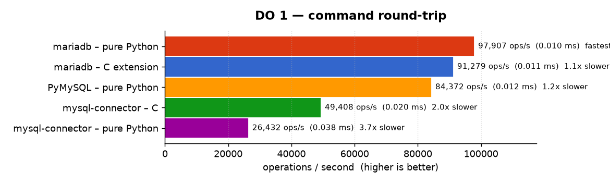
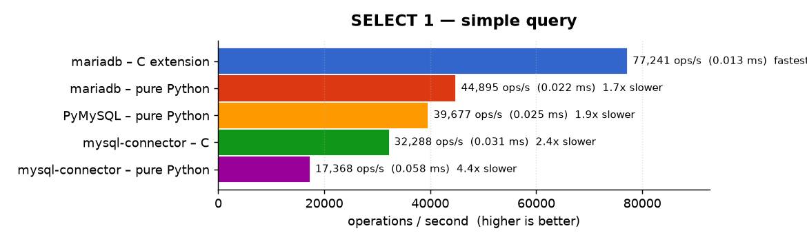

### Insert

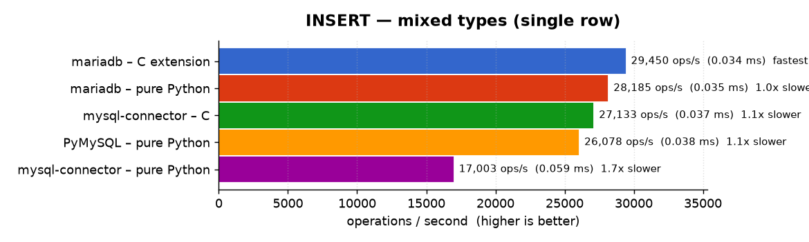
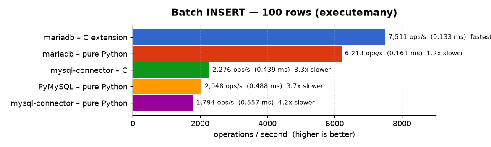
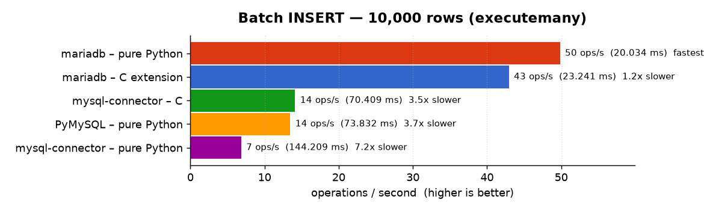

### Bulk reads

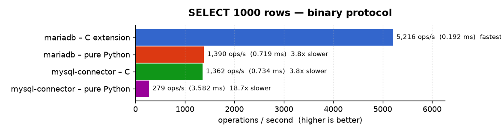
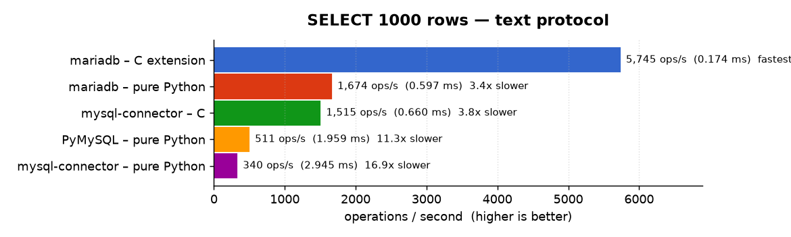

### Wide rows

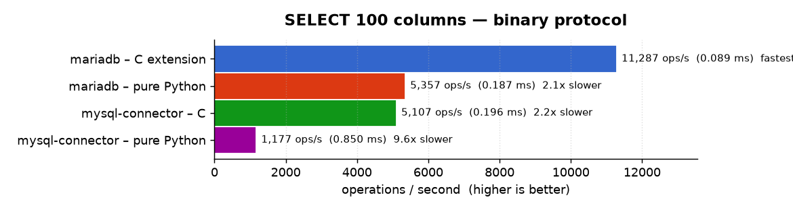
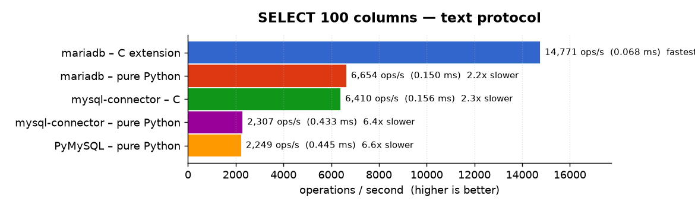

### Many parameters

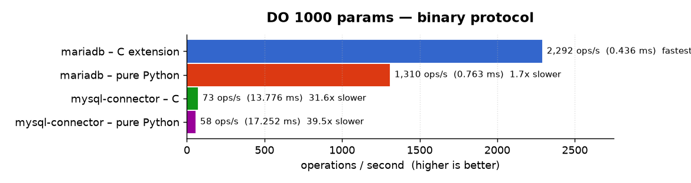
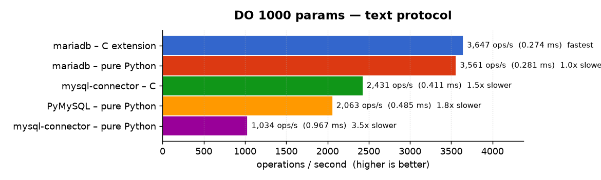

### Threads and pools

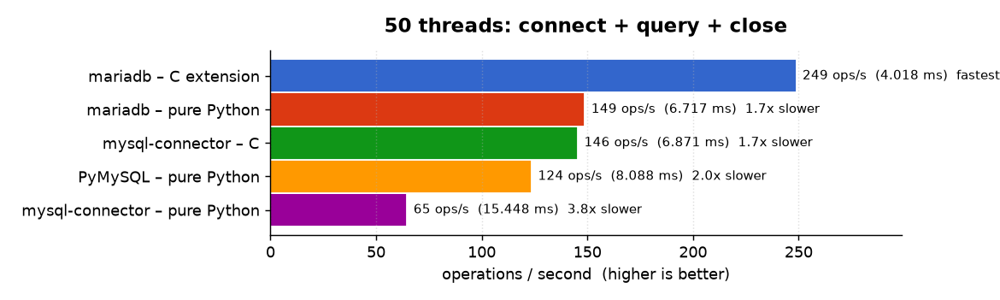
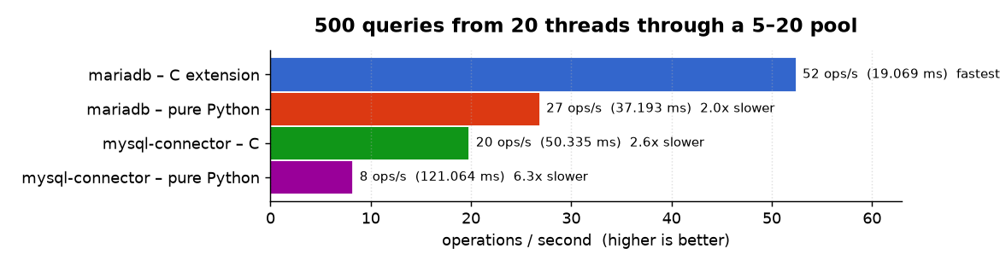

## Asynchronous drivers

The `asyncio` suite compares `mariadb.AsyncConnection` (C extension and pure
Python) with asyncmy and aiomysql on one event loop, over the same Unix socket
with TLS off. The first six benchmarks mirror the synchronous ones; the three
scenarios that follow are modelled on
[asyncmy's own benchmark suite](https://github.com/long2ice/asyncmy/tree/dev/benchmark):
a 10,000-row batch insert, 50 concurrent connections (each doing connect,
a single-row point query and close), and 500 concurrent queries through a
5–20 connection pool
(`mariadb.create_async_pool`, `asyncmy.pool.create_pool`, `aiomysql.create_pool`).

When reading the `SELECT 1000 rows` row below, keep in mind that the
`mariadb` async drivers deliberately favour small result sets over large
ones: per-query overhead (round-trip, connection setup, pool hand-off) is
minimised first, because the vast majority of application queries return a
handful of rows. Bulk reads are a secondary target.

The row decoder illustrates the choice. asyncmy resolves a converter
function per column once per result set and then calls `converter(value)`
for every field; the `mariadb` decoder settles a small decoder code per
column while the column definitions are read (so a result set costs it no
setup at all) and dispatches on that code inline, with the most common
types tested first. Replaying the same text-protocol buffers through the
pure-Python decoder written both ways (best of 15 runs, one core,
CPython 3.14, `colfunc_bench.py`) gives:

| Result set | inline dispatch (ours) | per-column functions | change |
|---|---|---|---|
| 1 row × 1 int (`SELECT 1`) | 462 ns | 638 ns | +38% |
| 1 row × 10 mixed columns | 2.57 µs | 3.50 µs | +36% |
| 1000 rows × 1 int | 278 µs | 352 µs | +27% |
| 1000 rows × 10 mixed columns | 2.51 ms | 2.88 ms | +15% |

The per-column-function layout is behind at every size, most of all on the
one-row results; asyncmy's lead on 1000 rows comes from its Cython
implementation rather than from that layout.

| Benchmark | mariadb – C extension (async) | mariadb – pure Python (async) | asyncmy – C (Cython) | aiomysql – pure Python |
|---|---|---|---|---|
| DO 1 — command round-trip | 30,256 ops/s (1.1x) | 31,446 ops/s (1.1x) | 33,963 ops/s **(fastest)** | 29,839 ops/s (1.1x) |
| SELECT 1 — simple query | 26,118 ops/s **(fastest)** | 20,667 ops/s (1.3x) | 22,727 ops/s (1.1x) | 19,509 ops/s (1.3x) |
| Batch INSERT — 100 rows (executemany) | 5,027 ops/s (1.0x) | 5,142 ops/s **(fastest)** | 2,209 ops/s (2.3x) | 1,964 ops/s (2.6x) |
| Batch INSERT — 10,000 rows (executemany) | 44 ops/s (1.2x) | 52 ops/s **(fastest)** | 18 ops/s (2.9x) | 15 ops/s (3.4x) |
| SELECT 1000 rows | 2,678 ops/s (2.1x) | 1,624 ops/s (3.5x) | 5,652 ops/s **(fastest)** | 430 ops/s (13.1x) |
| SELECT 100 columns | 11,989 ops/s **(fastest)** | 5,783 ops/s (2.1x) | 4,497 ops/s (2.7x) | 2,118 ops/s (5.7x) |
| DO 1000 params | 3,504 ops/s (1.0x) | 3,642 ops/s **(fastest)** | 2,818 ops/s (1.3x) | 2,404 ops/s (1.5x) |
| 50 concurrent connect + query + close | 226 ops/s **(fastest)** | 125 ops/s (1.8x) | 154 ops/s (1.5x) | 130 ops/s (1.7x) |
| 500 concurrent queries through a 5–20 pool | 36 ops/s **(fastest)** | 25 ops/s (1.4x) | 9 ops/s (4.0x) | 16 ops/s (2.2x) |

*(Multiplier in parentheses is how much slower than the fastest driver for that row.)*

### Simple operations

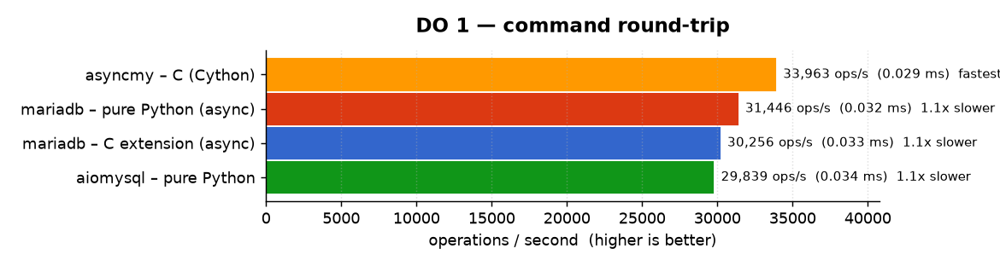
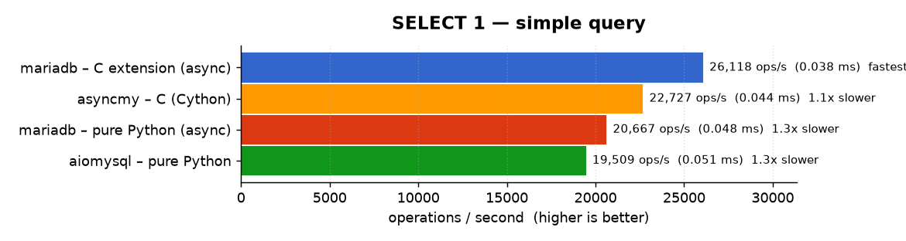

### Insert

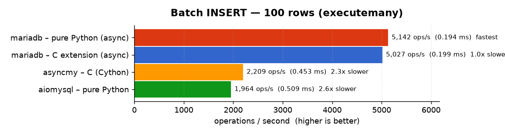
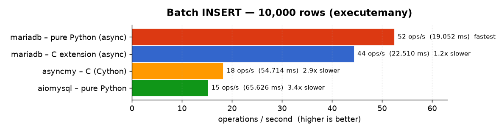

### Bulk reads and wide rows

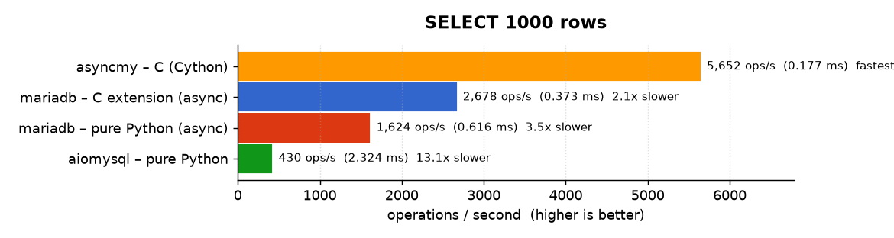
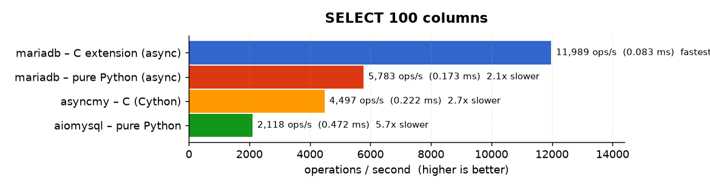

### Many parameters

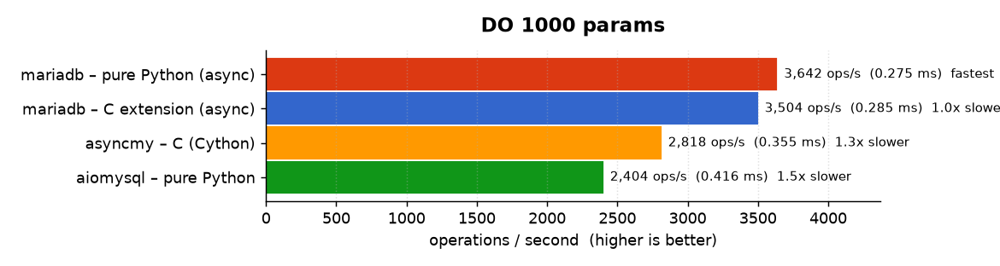

### Concurrency and pools

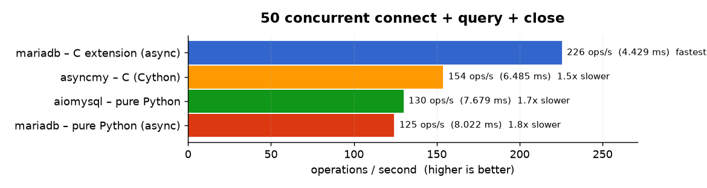
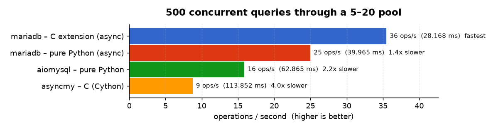

## Reproducing

From a checkout, with a MariaDB/MySQL server running:

```bash
cd benchmarks
pip install -r requirements-bench.txt          # pytest-benchmark, pymysql, mysql-connector-python, asyncmy, aiomysql
export TEST_DB_HOST=127.0.0.1 TEST_DB_PORT=3306 TEST_DB_USER=root TEST_DB_DATABASE=testp
export TEST_DB_UNIX_SOCKET=/run/mysqld/mysqld.sock   # all drivers over this socket; unset for TCP/IP
python run_all_benchmarks.py                    # sync drivers  -> results_<timestamp>/benchmark_<driver>.json
python run_async_benchmarks.py --all            # async drivers -> benchmark_async_<driver>.json (+ comparison table)
```

For the stable numbers shown above, pin the CPU to maximum frequency, pin the
client to one core, warm the machine with a discarded pass, then report the
**median** of several passes (which filters out any unlucky pass):

```bash
sudo cpupower frequency-set -g performance      # restore later: -g powersave
taskset -c 4 python run_all_benchmarks.py        # warm-up (discarded)
for i in 1 2 3; do                               # reported passes -> three results_* dirs
  taskset -c 4 python run_all_benchmarks.py
done
taskset -c 4 python run_async_benchmarks.py --all   # warm-up (discarded)
for i in 1 2 3; do                               # reported passes
  taskset -c 4 python run_async_benchmarks.py --all
  mkdir -p results_async_$i && mv benchmark_async_*.json results_async_$i/
done
```

Regenerate the charts and both tables on this page from the results
directories (charts are rendered with [matplotlib](https://matplotlib.org/)
using the Google Charts colour palette; with several directories the
per-benchmark median across them is used):

```bash
pip install matplotlib
python make_charts.py results_* results_async_*   # writes ../docs/benchmarks/*.png,
                                                  # comparison_table.md and comparison_table_async.md
taskset -c 4 python colfunc_bench.py              # row-decoder layout comparison (async section)
```

Individual drivers and benchmarks can also be run directly — see
[`benchmarks/README.md`](../benchmarks/README.md) and
[`benchmarks/BENCHMARKS.md`](../benchmarks/BENCHMARKS.md).
